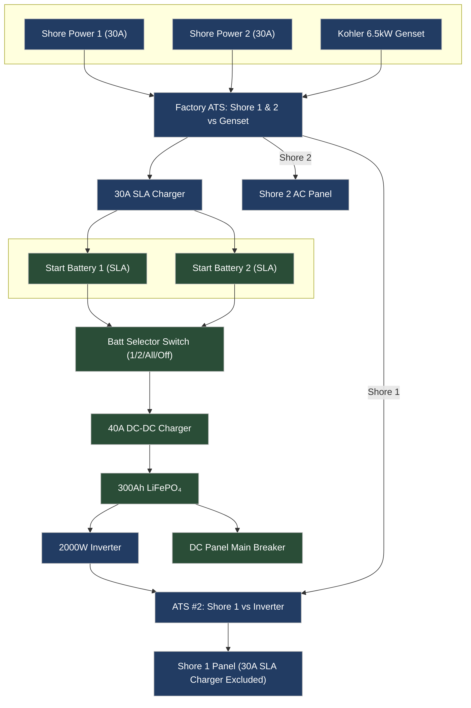

# Electrical Schematic for LiFePO₄ and 2000w inverter

```mermaid
flowchart TD

  %% === Top Row: Sources ===
  subgraph DC_SOURCES[" "]
    START1["Start Battery 1 (SLA)"]
    START2["Start Battery 2 (SLA)"]
  end

  subgraph AC_SOURCES[" "]
    SP1["Shore Power 1 (30A)"]
    SP2["Shore Power 2 (30A)"]
    GEN["Kohler 6.5kW Genset"]
  end

  %% === Middle Left: DC Control ===
  BAT_SW["Batt Selector Switch (1/2/All/Off)"]
  DC_DC["40A DC-DC Charger"]
  LFP["300Ah LiFePO₄"]
  DC_MAIN["DC Panel Main Breaker"]

  %% === Middle Right: AC Control ===
  ATS1["Factory ATS: Shore 1 & 2 vs Genset"]
  ATS2["ATS #2: Shore 1 vs Inverter"]

  %% === Center: Inverter Bridge ===
  INV["2000W Inverter"]

  %% === Bottom: Load Panels ===
  PANEL1["Shore 1 Panel (30A SLA Charger Excluded)"]
  PANEL2["Shore 2 AC Panel"]
  SLA_CHG["30A SLA Charger"]

  %% === DC Flow ===
  START1 --> BAT_SW
  START2 --> BAT_SW
  BAT_SW --> DC_DC --> LFP
  LFP --> INV
  LFP --> DC_MAIN

  %% SLA Charger: FROM ATS1 (Shore/Genset Only) TO Start Batteries
  ATS1 --> SLA_CHG
  SLA_CHG --> START1
  SLA_CHG --> START2

  %% === AC Flow ===
  SP1 --> ATS1
  SP2 --> ATS1
  GEN --> ATS1
  ATS1 -->|Shore 2| PANEL2
  ATS1 -->|Shore 1| ATS2
  INV --> ATS2
  ATS2 --> PANEL1

  %% Positioning & Styling
  classDef dc fill:#2a4d37,color:#ffffff,stroke:#bbbbbb;
  classDef ac fill:#223c63,color:#ffffff,stroke:#bbbbbb;
  class START1,START2,BAT_SW,DC_DC,LFP,DC_MAIN dc;
  class SP1,SP2,GEN,ATS1,ATS2,PANEL1,PANEL2,SLA_CHG,INV ac;

```
